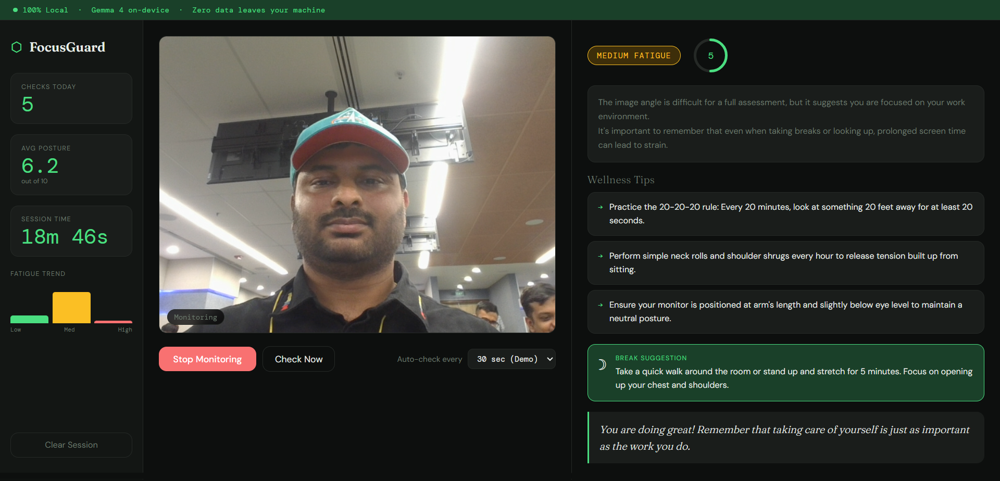
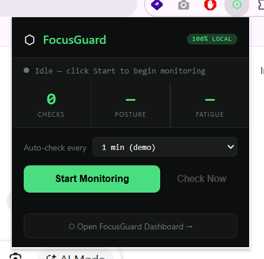

# FocusGuard 🛡️
### Local Mental Wellness Monitor — Built with Gemma 4

> **Privacy-first screen fatigue detection. Zero data leaves your machine.**

FocusGuard uses your webcam and Gemma 4 (running locally via LM Studio) to monitor signs of eye strain, poor posture, and mental fatigue during long screen sessions — then delivers wellness tips as gentle in-app notifications.

## 📸 Demo Preview

### Web Dashboard & Live Monitor


### Chrome Extension Background Monitor


---

## Problem Statement

Screen workers spend 8–12 hours daily in front of monitors. This causes:
- Eye strain and digital fatigue
- Poor posture and musculoskeletal stress
- Mental fatigue and reduced cognitive performance

Existing solutions require cloud APIs, risking privacy. FocusGuard solves this with **on-device AI**.

---

## Solution

**Vertical:** Mental Health

**Approach:**
1. Webcam captures a frame at randomized intervals (5–30 min, with ±20% jitter)
2. Frame sent to local Flask backend (base64 JPEG)
3. Gemma 4 e4b (via LM Studio) analyzes: posture, eye fatigue, stress signals
4. Structured JSON response: fatigue level, posture score, tips, break suggestion
5. UI renders insights + toast notification. Session stats tracked in-memory

**Privacy guarantee:** All processing is local. No frame, no data, no analytics are ever sent to any external server.

---

## Google Services Used

- **Gemma 4 e4b** — multimodal on-device AI model by Google
- **Google Fonts** — DM Sans, Fraunces, DM Mono

---

## Tech Stack

- **Backend:** Python 3.11, Flask 3.x
- **AI:** Gemma 4 e4b via LM Studio (OpenAI-compatible local API)
- **Frontend:** Vanilla JS, CSS3, HTML5 WebRTC (getUserMedia)
- **Testing:** pytest (15 tests)

---

## Setup

### Prerequisites
- [LM Studio](https://lmstudio.ai/) with `google/gemma-4-e4b` loaded and server running on port 1234
- Python 3.11+
- Git

### Run Locally

```bash
git clone <your-repo-url>
cd focusguard
pip install -r requirements.txt
python app.py
```

Visit `http://localhost:5000`

---

## Chrome Extension

FocusGuard ships as a Chrome Extension for OS-level notifications that appear
even when the browser is minimized — solving the missed-notification problem
of web push entirely.

### How to install

1. Open Chrome and go to `chrome://extensions`
2. Enable **Developer Mode** (top right toggle)
3. Click **Load unpacked**
4. Select the `extension/` folder from this repo
5. Pin FocusGuard to your toolbar

### How it works

- Click the ⬡ icon in Chrome toolbar to open the popup
- Set your preferred check interval (1 min for demo, 10 min for real use)
- Click **Start Monitoring**
- Chrome Alarms API fires checks in the background — even if you switch tabs
- Each check captures your webcam, sends to local Flask on `localhost:5000`
- Gemma 4 analyzes locally and fires a native OS notification with your wellness tip
- High fatigue notifications **stay on screen until dismissed**

### Privacy

All webcam frames are sent only to `localhost:5000`.
No data leaves your machine at any point.

---

## Architecture

```
Browser (WebRTC)
    │  base64 JPEG frame
    ▼
Flask /analyze endpoint
    │  multimodal prompt
    ▼
LM Studio → Gemma 4 e4b (local)
    │  JSON: fatigue, posture, tips
    ▼
SessionTracker (in-memory)
    │
    ▼
UI: insight panel + toast notification
```

---

## Evaluation Coverage

| Criteria | Implementation |
|----------|---------------|
| Code Quality | Modular: app.py, routes.py, gemma.py, session_tracker.py, exceptions.py |
| Security | No external calls, input validation, size limits, no PII stored |
| Efficiency | Compressed JPEG (0.7 quality), async fetch, in-memory session |
| Testing | 15 pytest tests with mocking |
| Accessibility | ARIA labels, live regions, semantic HTML, keyboard-accessible controls |
| Google Services | Gemma 4 e4b (Google's multimodal model) |
| Problem Alignment | Mental Health — screen fatigue, posture, wellness |

---

## License

MIT — Built for PromptWars In-Person Hyderabad, May 2026
